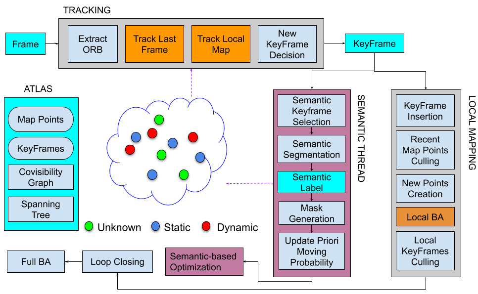

# Introduction

The scene rigidity is a strong assumption in typical visual Simultaneous Localization and Mapping (vSLAM) algorithms. Such strong assumption limits the usage of most vSLAM in dynamic real-world environments, which are the target of several relevant applications such as augmented reality, semantic mapping, unmanned autonomous vehicles, and service robotics. 

Many solutions are proposed that use different kinds of semantic segmentation methods (e.g., Mask R-CNN, SegNet) to detect dynamic objects and remove outliers. However, as far as we know, such kinds of methods wait for the semantic results in the tracking thread in their architecture, and the processing time depends on the segmentation methods used. 

In this paper, we present RDS-SLAM, a real-time visual dynamic SLAM algorithm that is built on ORB-SLAM3 and adds a semantic thread and a semantic-based optimization thread for robust tracking and mapping in dynamic environments in real-time. These novel threads run in parallel with the others, and therefore the tracking thread does not need to wait for the semantic information anymore. 
Besides, we propose an algorithm to obtain as the latest semantic information as possible, thereby making it possible to use segmentation methods with different speeds in a uniform way. We update and propagate semantic information using the moving probability, which is saved in the map and used to remove outliers from tracking using a data association algorithm.

This repo is a simplified sample source code of RDS-SLAM. Note that it is not exactly as the same as the paper. 



# Demo

-   Real Environment
    -   Mask R-CNN + Kinect: <https://youtu.be/-peAZEO6Bbo>
-   TUM Dataset (Mask R-CNN)
    -   walk xyz: <https://youtu.be/P-dew4M5Un0>
-   TUM Dataset (SegNet)
    -   walk xyz: <https://youtu.be/7E7Y5ER11B8>

# Develop environments

-   ubuntu: 18.04
-   ROS melodic
-   docker: 19.03 [optional]
-   dock-compose: 1.26.2 [optional]
-   cuda: 10.2
-   OpenCV 3.3.1

# How to use

## How to deploy using docker

```sh
cd docker
docker-compose bulid
docker-compose up
```

## How to deploy on the local machine

We recommand using the docker virtual machine. 
Please build the dependencies sequentially if you want to build on your local machine:

-   SegNet_ROS
-   MaskRCNN_ROS
-   SLAM

## How to build SLAM client

catkin_ws is a ROS workspace.

```sh
cd ~/catkin_ws/src/SLAM/
./build_thirdparty.sh

cd ~/catkin_ws
catkin_make
```

## How to run demo

```sh
roslaunch segnet_ros action_server.launch
```

[Important] Please run w/static to initialize **GPU** before you evaluate any datasets.

```sh
roslaunch rds_slam tum_segnet_walk_static.launch
```

```sh
roslaunch rds_slam tum_segnet_walk_xyz.launch
```

# Dataset

-   Let docker access your dataset if you use docker 

```sh
vim docker/.env

DATASET_DIR=/.../data/Dataset
```

-   TUM dataset 
     RDS-SLAM evaluated using the [TUM](https://vision.in.tum.de/data/datasets/rgbd-dataset) dataset
      Please download the TUM dataset sequences. Please check the folder path and change the folder path in the launch files and docker configuration if available.
-   KITTI dataset
    In principle, RDS-SLAM support mono camera and stereo camera. 
    We will try to enable and  evaluate them later.

# Notes

-   [**Important**] please run a dataset to initialize the GPU  before you evaluate the time and tracking performance.
-   Please use the data listed in the original paper because the tracking performance and real-time performance is somehow related to the GPU and CPU configuration
-   The real-time performance and tracking performance can be trade off by controlling the frame rate by adjusting some  parameters in the SLAM main loop.
-   The framerate can be controlled from offline to 30HZ. But you need to trade off the tracking performance and real-time performance.
-   Either SegNet or Mask R-CNN version can be kicked off at a time.
-   [Semantic mapping] please refer RTS-vSLAM if you want to build the semantic map.
    RTS-vSLAM: Real-time Visual Semantic Tracking and Mapping under Dynamic Environments

# References

[1] Y. Liu and J. Miura, "RDS-SLAM: Real-Time Dynamic SLAM Using Semantic Segmentation Methods," in IEEE Access, vol. 9, pp. 23772-23785, 2021, doi: 10.1109/ACCESS.2021.3050617. [PDF](https://ieeexplore.ieee.org/document/9318990)

[2] Y. Liu and J. Miura, “RDMO-SLAM: Real-Time Visual SLAM for Dynamic Environments Using Semantic Label Prediction With Optical Flow,” IEEE Access, vol. 9, pp. 106981–106997, 2021, doi: 10.1109/ACCESS.2021.3100426. [PDF](https://ieeexplore.ieee.org/stamp/stamp.jsp?arnumber=9497091)

[3] Y. Liu and J. Miura, "KMOP-vSLAM: Dynamic Visual SLAM for RGB-D Cameras using K-means and OpenPose," 2021 IEEE/SICE International Symposium on System Integration (SII), 2021, pp. 415-420, doi: 10.1109/IEEECONF49454.2021.9382724. [PDF](https://ieeexplore.ieee.org/document/9382724)

[4] Badrinarayanan, Vijay, Alex Kendall, and Roberto Cipolla. "Segnet: A deep convolutional encoder-decoder architecture for image segmentation." IEEE transactions on pattern analysis and machine intelligence 39.12 (2017): 2481-2495. [PDF](https://arxiv.org/abs/1511.00561)

[5] Campos, Carlos, et al. "ORB-SLAM3: An Accurate Open-Source Library for Visual, Visual–Inertial, and Multimap SLAM." IEEE Transactions on Robotics (2021). [PDF](https://arxiv.org/pdf/2007.11898.pdf)

[6] He, Kaiming, et al. "Mask r-cnn." Proceedings of the IEEE international conference on computer vision. 2017. [PDF](https://arxiv.org/pdf/1703.06870.pdf)

# License

-   ORB-SLAM3
    ORB-SLAM3 is released under GPLv3 license. For a list of all code/library dependencies (and associated licenses), please see [Dependencies.md](https://github.com/UZ-SLAMLab/ORB_SLAM3/blob/master/Dependencies.md).

-   SegNet_ROS
    A ROS version of SegNet.  SegNet_ROS is released under GPLV3.
    We used [SegNet-Tutorial](https://github.com/alexgkendall/SegNet-Tutorial).

-   RDS-SLAM
    RDS-SLAM is released under GPLv3 license. The code/library dependencies is the same as ORB_SLAM3.

# Discussion

-   The tracking performance is somehow influenced by the GPU and CPU configuration. This will result in unstable tracking in some devices. In such case, please lower the framerate by adjusting the prameters in the SLAM end.
-   RDS-SLAM did not obviously deal with the unkown objects that not belonging to the predefined objects. The geometric cleck in G2o/BA can detect and remove some outliers. KMOP-vSLAM is a solution that can deal with unknown objects.

# TODO

-   [ ] seperate SegNet and MasK R-CNN from SLAM client
