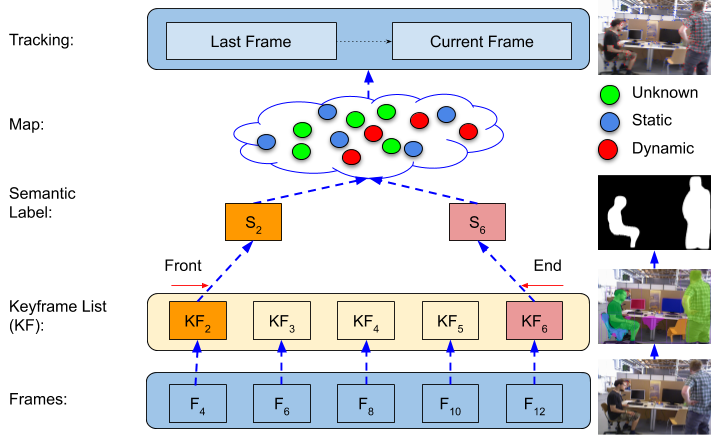

# Paper

RDS-SLAM: Real-time Dynamic SLAM using Semantic Segmentation Methods

# Demo

## Real Environment

-   Mask R-CNN + Kinect: <https://youtu.be/-peAZEO6Bbo>

## TUM Dataset (Mask R-CNN)

-   walk xyz: <https://youtu.be/P-dew4M5Un0>

## TUM Dataset (SegNet)

-   walk xyz: <https://youtu.be/7E7Y5ER11B8>

# Project Overview

# Notes

This paper is under review. 

This project will be open-source later
